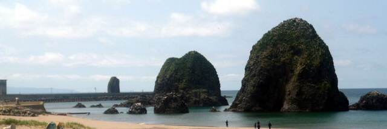

# 第41回南北海道考古学情報交換会

## 開催要項

- 期日　２０２０年12月5日（土）13時～12月6日（日）12時

- 会場　せたな生涯学習センター

  - 久遠郡せたな町瀬棚区本町6510
  - 0137-87-3901

- テーマ　『道南日本海側の続縄文時代を学ぶ～南川遺跡出土の遺物から～』

- 主　催　南北海道考古学情報交換会

- 後　援　せたな町教育委員会・道南ブロック博物館施設等連絡協議会

## 日程

### １２月５日（土）

- １２：００～１３：００　受　　付
- １３：００～１３：０５  開 会 式
- １３：０５～１５：５０　第 Ⅰ 部　情報交換１　『道南日本海側の続縄文時代を学ぶ～南川遺跡出土の遺物から～』
- １３：０５～１４：００　基調講演「続縄文時代の概説」

  - 講師：佐藤　　剛（北海道埋蔵文化財センター）
- １４：１０～１５：５０　　出土遺物の実見
- １６：００～１６：１５　　「防災考古学」の提唱　   　横山　英介（北海道考古学研究所）　
- １６：１５～１６：３０　　「防災考古学」事例報告　 山田　　 央（七飯町教育委員会）
- １６：３５～１７：００　総会

### １２月６日（日）

- ９：２５～１０：５０　　第 Ⅱ 部　情報交換２「渡島・檜山地域の発掘調査」　
  - 電電公社宿舎遺跡・権現台場遺跡（道南歴史文化振興財団）４０分
  - 史跡上之国館跡のうち花沢館跡（上ノ国町）２０分
  - 共立2遺跡・豊野4遺跡（北海道埋蔵文化財センター）２０分

- １１:００～１１：３０ 第 Ⅲ 部 情報交換３「渡島・檜山地域の考古学的調査及び取組み」　
  - 箱館戦争戦跡の考古学的調査（箱館戦争戦跡調査プロジェクト）15分
  - 厚沢部町における近現代墓標の記録調査（石井淳平）15分

- １１：３５～１１：４５   閉会式

# コロナウイルス感染症対策について 
## イベント主催にかかる遵守事項
- 消毒の徹底
- マスク着用の担保
- 参加者および出演者制限（検温等）
- 参加者の把握
- 大声の抑止
- 密集の回避
- 演者・観客間の接触・飛沫感染防止
- 催し物前後の行動管理
- 業種別ガイドラインの遵守
- 感染防止の取り組みの公表

## 消毒の徹底

- 参加者に対して、入場時、定時（講演終了時等）での消毒徹底を呼びかけます
- マイク及び演台等の講師入れ替え時消毒します。

## マスク着用の担保

- 出席者へのマスク着用のアナウンスします。
- マスク非持参者へのマスク配布します。

## 参加者及び入場者制限

- 入場時の検温を実施します。
- ウェブ配信による非来場者の参加を推進します。

## 参加者の把握

- 入場時の住所・氏名・電話番号記載を徹底します。
- 座席指定（座席番号付番）による参加者把握を実施します。

## 大声を出さないことの担保

- Slidoを用いた発声に頼らない応答方法を推進します。
- ウェブ経由の質問を優先し、会場からの質疑を極力減らします。

## 密集の回避

- 喫煙所等、密集する可能性の有る施設利用を禁止します。

## 演者・観客間の接触・飛沫感染リスクの排除

- 演者のマスク着用を徹底します。
- 演者はスクリーンを使用し、飛沫拡散防止に務めます。

## 催物前後の行動管理

- 懇親会の分散開催を実施します。

## 業種別ガイドラインの遵守

- 公益社団法人全国公民館連合会「公民館における新型コロナウイルス感染拡大予防ガイドライン」及び公益財団法人日本博物館協会「博物館における新型コロナウイルス感染拡大予防ガイドライン」を遵守します。

## イベント主催者及び施設管理者双方による感染防止の取り組みの公表

- 交換会HPの作成
- 上記取り組みの列記

  

# 警戒ステージに応じた対応

## ステージ３

### 要請内容

- 感染拡大防止対策を講じていない施設への外出自粛
- 同種の集団感染が複数発生するなど、これまでの対策では感染リスクの回避が困難な業態への外出自粛
- 感染拡大地域との**往来自粛**
- 不要不急の外出自粛 など

### 対応事項

- 講師佐藤剛氏の招聘が不可能となる可能性が高いことから、佐藤氏については、**オンライン**による講演とする。
- 必要機材
  - ZoomProアカウント（月額2,000円）

## ステージ４

### 要請内容

- 感染拡大防止対策を講じていない施設の使用制限等
- イベント制限（人数上限、収容率規制）等の要請

### 対応事項

- 講師佐藤剛氏の招聘が不可能となることから、佐藤氏については、**オンライン**による講演とする。
- 必要機材
  - ZoomProアカウント（月額2,000円）

## ステージ5

### 要請内容

- 施設の使用制限等
- 開催の**自粛**等

### 対応事項

- 完全**オンライン**開催とする。
- オンライン対応可能な報告者のみ参加
- 総会は**書面**とする。
- 必要機材
  - ZoomProアカウント（月額2,000円）
