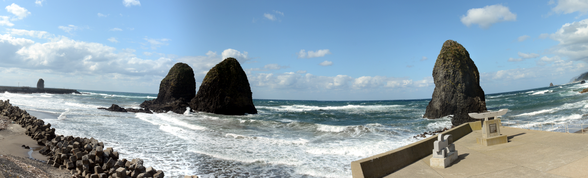

# 南北海道考古学情報交換会特別講演

## お知らせ

新型コロナウイルス感染症の拡大により北海道が警戒ステージ4を発出しました。これを受け、12月5日（土）〜12月6日（日）に開催予定の第41回南北海度考古学情報交換会は中止することとしました。

予定しておりました基調講演「ユベオッ（続縄文）時代の概説」（佐藤剛氏）については、特別講演として下記のとおりZoom配信を行います。

------

## 開催要項

- 期日　2021年2月20日（土）13時30分～15時00分
- 内容　Zoomによるオンライン配信

- テーマ　『道南日本海側の続縄文時代を学ぶ～南川遺跡出土の遺物から～』
- 主　催　南北海道考古学情報交換会

## ウェブ配信

Zoomによるウェブ配信を行います。

- Zoom設定　
	- URL  https://us02web.zoom.us/j/86270344089
	- ミーティングID　862 7034 4089
- 佐藤氏報告資料[「ユベオッ（続縄文）時代の概説」](report/satou.pdf)（各自でダウンロードしてください。）
	- 佐藤氏報告資料は個人的な利用の範囲において複製等を許可します。
	- 佐藤氏報告資料の引用にかかる出典は「2021『南北海道考古学情報交換会特別講演資料』」などとしてください。
  

## 日程

### ２月20日（土）

- 13:00～13:30	ログイン受付（時間を過ぎてもログイン可能です）
- 13:30～13:35　開会挨拶（野村代表）
- 13:35～14:30　基調講演「ユベオッ（続縄文）時代の概説」
- 講師：佐藤　　剛（北海道埋蔵文化財センター）
- 14:30～14:55　質疑応答
- 15:00　　　　　閉会

# 誌上報告

- 「渡島・檜山地域の発掘調査」　
  - [電電公社合宿舎遺跡](report/denden/merge_denden.pdf)・[権現台場遺跡](report/gongen/merge.pdf)・[大船H遺跡](report/oohune/merge_oohune.pdf)（道南歴史文化振興財団）40分
  - [史跡上之国館跡のうち花沢館跡](report/hanazawa/hanazawa/pdf)（上ノ国町）20分
  - [共立2遺跡・豊野4遺跡](report/suemitu.pdf)（北海道埋蔵文化財センター）20分
- 「渡島・檜山地域の考古学的調査及び取組み」　
  - [箱館戦争戦跡の考古学的調査](report/2020川汲台場調査報告_道南考古発表資料.pdf)（箱館戦争戦跡調査プロジェクト）15分
  - [厚沢部川流域近現代墓標の考古学的研究](report/200808厚沢部町内墓地の考古学的研究.pdf)（あっさぶ文化遺産調査プロジェクト）15分

